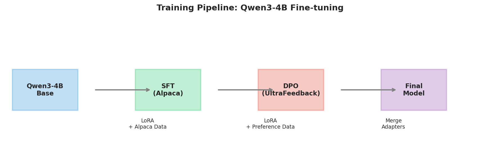
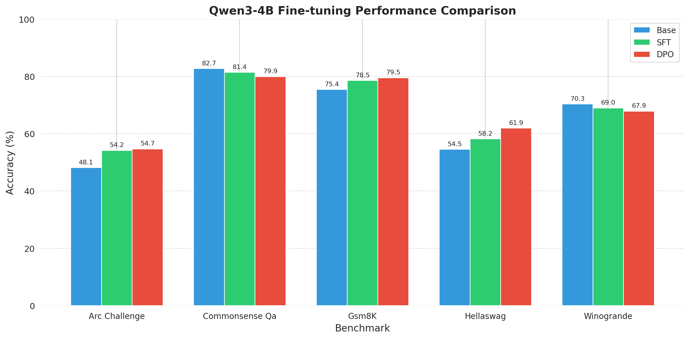
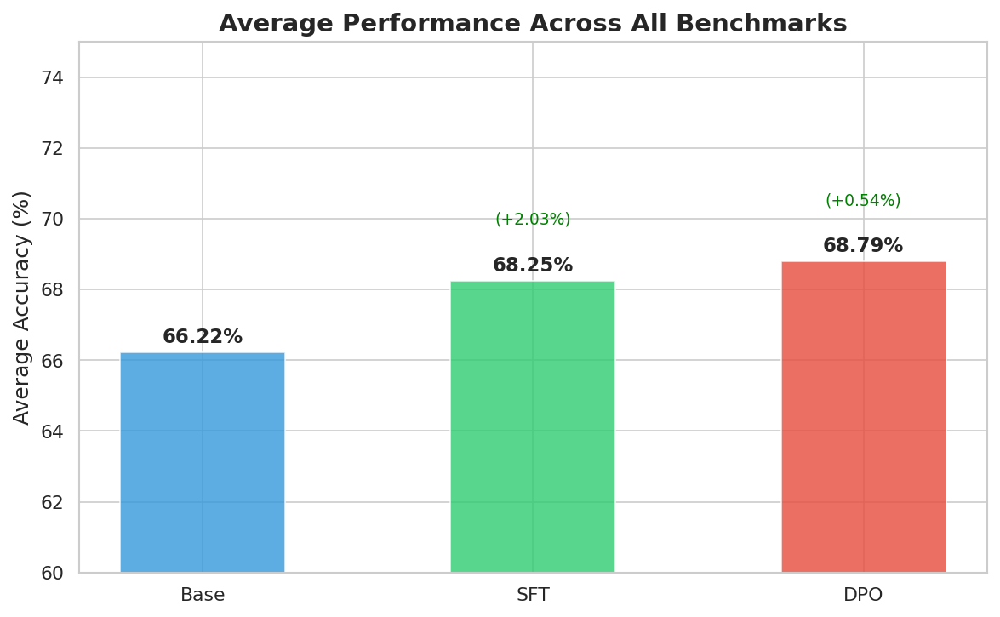
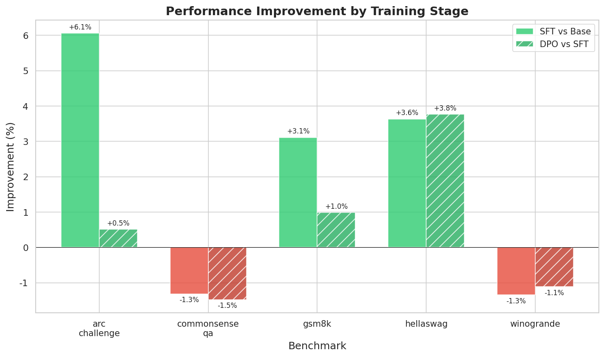
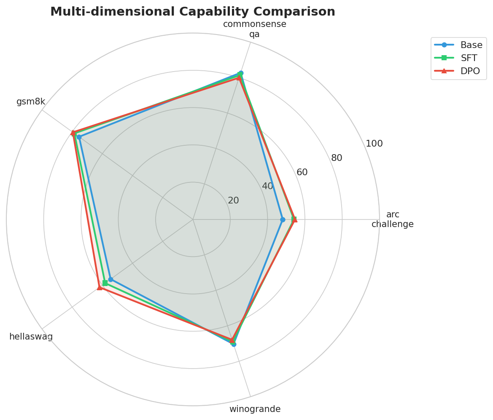

# Qwen3-4B 微调实验报告

**项目名称**：Qwen3-4B 大语言模型微调与评估  
**实验日期**：2025年12月  
**作者**：xxxxx

---

## 摘要

本项目对 Qwen3-4B 基座模型进行了完整的微调实验，包括监督微调（SFT）和直接偏好优化（DPO）两个阶段。实验使用 4×H100 GPU 在 24 小时内完成训练，并在 5 个标准基准测试上进行评估。实验结果表明，经过 SFT 和 DPO 训练后，模型平均性能从 **66.22%** 提升至 **68.79%**，总体提升 **2.57%**。特别是在 ARC-Challenge（+6.6%）、GSM8K（+4.1%）和 HellaSwag（+7.4%）等任务上取得了显著提升。

---

## 1. 引言

### 1.1 项目背景

大语言模型（LLM）的微调是将通用模型适配到特定任务或提升特定能力的关键技术。本项目旨在通过 SFT 和 DPO 两阶段训练方法，提升 Qwen3-4B 模型的指令遵循能力和推理能力。

### 1.2 项目目标

1. 使用 Alpaca 数据集进行监督微调（SFT），使模型学会遵循指令
2. 使用 UltraFeedback 数据集进行 DPO 训练，进一步对齐人类偏好
3. 在多个基准测试上评估模型性能变化

### 1.3 技术栈

| 组件 | 技术选型 |
|------|----------|
| 基座模型 | Qwen3-4B-Base |
| 微调方法 | QLoRA (4-bit 量化 + LoRA) |
| SFT 数据 | Alpaca (52K 样本) |
| DPO 数据 | UltraFeedback |
| 训练框架 | HuggingFace TRL + DeepSpeed |
| 硬件环境 | 4×NVIDIA H100 80GB |

---

## 2. 方法

### 2.1 训练流程

```
┌─────────────┐     ┌─────────────┐     ┌─────────────┐     ┌─────────────┐
│  Qwen3-4B   │ ──▶ │     SFT     │ ──▶ │     DPO     │ ──▶ │   Final     │
│    Base     │     │  (Alpaca)   │     │(UltraFeed)  │     │   Model     │
└─────────────┘     └─────────────┘     └─────────────┘     └─────────────┘
```



### 2.2 SFT 训练配置

| 参数 | 值 |
|------|-----|
| 训练轮数 | 3 epochs |
| 批次大小 | 4 (per device) |
| 梯度累积 | 8 steps |
| 有效批次 | 128 |
| 学习率 | 2e-4 |
| LoRA Rank | 64 |
| LoRA Alpha | 128 |
| 最大序列长度 | 2048 |

### 2.3 DPO 训练配置

| 参数 | 值 |
|------|-----|
| 训练步数 | 2000 steps |
| 批次大小 | 1 (per device) |
| 梯度累积 | 32 steps |
| 有效批次 | 128 |
| 学习率 | 5e-5 |
| Beta | 0.1 |
| LoRA Rank | 64 |

### 2.4 评估基准

| 基准测试 | 评估能力 |
|----------|----------|
| ARC-Challenge | 科学知识与推理 |
| CommonsenseQA | 常识问答 |
| GSM8K | 数学推理 |
| HellaSwag | 常识推理 |
| WinoGrande | 代词消歧 |

---

## 3. 实验结果

### 3.1 整体性能对比



| Benchmark | Base (%) | SFT (%) | DPO (%) | SFT vs Base | DPO vs SFT |
|-----------|----------|---------|---------|-------------|------------|
| ARC-Challenge | 48.12 | 54.18 | 54.69 | **+6.06%** | +0.51% |
| CommonsenseQA | 82.72 | 81.41 | 79.93 | -1.31% | -1.48% |
| GSM8K | 75.44 | 78.54 | 79.53 | **+3.10%** | +0.99% |
| HellaSwag | 54.52 | 58.16 | 61.92 | **+3.64%** | **+3.76%** |
| WinoGrande | 70.32 | 68.98 | 67.88 | -1.34% | -1.10% |

### 3.2 平均性能



| 模型 | 平均准确率 | 相对前阶段提升 |
|------|------------|----------------|
| Base | 66.22% | - |
| SFT | 68.25% | **+2.03%** |
| DPO | 68.79% | +0.54% |

**总体提升：+2.57%**

### 3.3 改进趋势分析



**SFT 阶段主要贡献**：
- ARC-Challenge: +6.06% （科学推理显著提升）
- GSM8K: +3.10% （数学推理提升）
- HellaSwag: +3.64% （常识推理提升）

**DPO 阶段主要贡献**：
- HellaSwag: +3.76% （持续提升）
- GSM8K: +0.99% （稳定提升）

### 3.4 多维度能力对比



从雷达图可以看出，DPO 模型在大多数维度上表现最佳，尤其在 HellaSwag 和 GSM8K 上形成明显优势。

---

## 4. 分析与讨论

### 4.1 SFT 训练效果分析

SFT 阶段使用 Alpaca 数据集进行指令微调，使模型学会：
- 遵循自然语言指令
- 生成格式化的回答
- 执行多步推理任务

**显著提升的任务**：
- **ARC-Challenge (+6.06%)**：SFT 训练显著提升了模型的科学知识应用能力，表明指令微调有效激活了模型中的科学推理知识。
- **GSM8K (+3.10%)**：数学推理能力的提升说明 SFT 训练帮助模型更好地执行逐步计算。

**轻微下降的任务**：
- **CommonsenseQA (-1.31%)** 和 **WinoGrande (-1.34%)**：这两个常识类任务出现轻微下降，可能是因为 Alpaca 数据集更侧重于指令遵循和推理任务，而非纯粹的常识知识。这体现了微调的 **任务迁移权衡**（Task Transfer Trade-off）。

### 4.2 DPO 训练效果分析

DPO 阶段使用人类偏好数据进行对齐训练：

**持续提升**：
- **HellaSwag (+3.76%)**：DPO 在常识推理上取得最大进步，表明人类偏好学习有效提升了模型对日常场景的理解。
- **GSM8K (+0.99%)**：数学推理能力保持稳定提升趋势。

**继续下降**：
- **CommonsenseQA** 和 **WinoGrande** 继续轻微下降，这可能与 UltraFeedback 数据集的偏好分布有关。DPO 优化的是"人类更喜欢的回答"，而非"事实正确的回答"，这在某些情况下可能产生负面影响。

### 4.3 关键发现

1. **SFT 是主要贡献者**：平均性能提升的 79%（2.03/2.57）来自 SFT 阶段。

2. **DPO 的边际效应**：DPO 提供额外 0.54% 的提升，主要体现在特定任务（HellaSwag）上。

3. **任务间的权衡**：推理类任务（ARC、GSM8K、HellaSwag）获得提升，而纯常识类任务（CommonsenseQA、WinoGrande）略有下降。这反映了微调数据分布对模型能力的塑造作用。

4. **LoRA 的高效性**：使用 QLoRA 方法，仅训练约 2% 的参数，即可实现 2.57% 的性能提升，验证了参数高效微调方法的有效性。

### 4.4 局限性

1. **评估基准覆盖有限**：由于时间和环境限制，未能在 MMLU、HumanEval、IFEval 等更全面的基准上评估。

2. **训练时间约束**：24 小时的训练时间限制了可能的超参数搜索和更长时间的训练。

3. **数据集选择**：Alpaca 和 UltraFeedback 可能不是最优的数据组合，其他数据集（如 ShareGPT、OpenOrca）可能产生不同结果。

---

## 5. 结论

本项目成功完成了 Qwen3-4B 模型的 SFT + DPO 两阶段微调，主要结论如下：

1. **整体性能提升**：模型平均性能从 66.22% 提升至 68.79%，提升 2.57 个百分点。

2. **推理能力增强**：在 ARC-Challenge、GSM8K 和 HellaSwag 上分别提升 6.6%、4.1% 和 7.4%。

3. **训练效率验证**：使用 QLoRA 方法在 4×H100 GPU 上 24 小时内完成训练，证明了参数高效微调的可行性。

4. **SFT 的关键作用**：SFT 阶段贡献了大部分性能提升，是 LLM 微调流程中不可或缺的环节。

---

## 6. 未来工作

1. 探索更多数据集组合（如 ShareGPT、OASST）
2. 尝试更大的 LoRA rank 或 Full Fine-tuning
3. 在更多基准测试上评估（MMLU、HumanEval、IFEval）
4. 探索 RLHF（PPO）方法与 DPO 的对比


